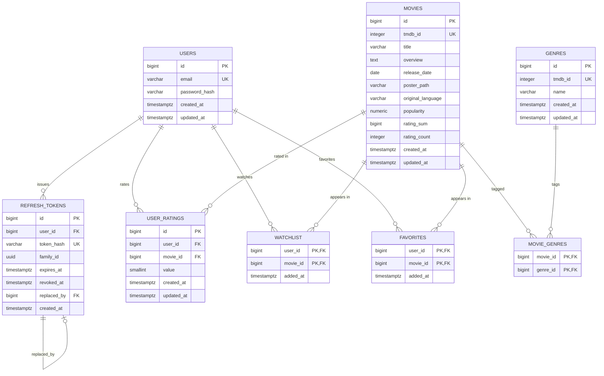

# Database Schema

The TMDB CRUD API persists data in PostgreSQL via TypeORM. Schema lives in `src/database/migrations/`; entities live alongside their feature modules under `src/{feature}/*.entity.ts`.

## ER diagram



## Tables

### `users`
Application accounts. Identified by email; passwords are stored as Argon2id hashes (hashing in PR #4).

| Constraint | Purpose |
|---|---|
| `UNIQUE (email)` | Login lookup + prevents duplicate accounts. |

### `refresh_tokens`
Long-lived auth tokens, rotated on every refresh. The raw token never reaches the database — only its sha256 hex digest.

| Constraint | Purpose |
|---|---|
| `UNIQUE (token_hash)` | Lookup key during `/auth/refresh`. |
| `FK user_id → users(id) ON DELETE CASCADE` | Tokens follow their user out the door. |
| `FK replaced_by → refresh_tokens(id) ON DELETE SET NULL` | Audit chain pointer to the token that superseded this one. SET NULL so cleanup of forward tokens doesn't cascade backwards. |

`family_id` (UUID) groups every token in a rotation chain. Presenting any revoked token in the family triggers revocation of the entire family (reuse detection).

### `genres`
TMDB-mirrored genre catalog. Small, finite set; refreshed by the sync job.

| Constraint | Purpose |
|---|---|
| `UNIQUE (tmdb_id)` | Idempotent upsert key for the TMDB sync (`ON CONFLICT (tmdb_id) DO UPDATE`). |

`id` is a local surrogate PK — keeps the schema decoupled from TMDB's ID space.

### `movies`
TMDB-mirrored catalog plus denormalized rating aggregates.

| Constraint | Purpose |
|---|---|
| `UNIQUE (tmdb_id)` | Sync upsert key. |

`rating_sum` (`BIGINT`) and `rating_count` (`INTEGER`) are kept transactionally in sync by the ratings service. Average rating is computed on read as `rating_sum::numeric / NULLIF(rating_count, 0)` — O(1) per movie, no LEFT JOIN + AVG + GROUP BY in the hot path.

Type choices worth noting:
- `release_date` is `DATE` (not `TIMESTAMPTZ`) — a release date is a calendar date, not an instant.
- `popularity` is `NUMERIC(8, 3)` — exact decimal, no float drift.

### `movie_genres`
First-class join table for the many-to-many between movies and genres. Composite PK `(movie_id, genre_id)` doubles as a uniqueness guarantee for idempotent sync upserts.

`ON DELETE CASCADE` on both FKs — deleting a movie or genre vaporizes its links.

### `user_ratings`
Per-user ratings. Source of truth; the denormalized aggregates on `movies` are derived from this table.

| Constraint | Purpose |
|---|---|
| `UNIQUE (user_id, movie_id)` | One rating per user per movie. Upsert key for PUT semantics. |
| `CHECK (value BETWEEN 1 AND 10)` | DB-level validation; defense in depth alongside DTO validation. |
| `FK user_id → users(id) ON DELETE CASCADE` | Ratings follow their user out the door. |
| `FK movie_id → movies(id) ON DELETE CASCADE` | No orphaned ratings. |

Surrogate `id` PK rather than composite `(user_id, movie_id)` PK because a rating is conceptually an entity with a value, not a pure membership row. The UNIQUE constraint still enforces the pair-wise uniqueness.

### `watchlist`
Pure membership: which movies a user wants to watch.

| Constraint | Purpose |
|---|---|
| `PRIMARY KEY (user_id, movie_id)` | Natural uniqueness; lookup key for per-user listing. |
| Both FKs `ON DELETE CASCADE` | Membership rows vanish with either parent. |

`added_at` is a property of the relationship, not the entity — useful for sort order ("most recently added first"). No surrogate id; the pair is the row.

### `favorites`
Structurally identical to `watchlist`. Separate table — a movie can be in both lists independently, and each can evolve features (e.g., notes, position) without coupling.

## Relationship summary

| From | To | Cardinality | Direction |
|---|---|---|---|
| users | refresh_tokens | 1 : N | Each user can have many refresh tokens (multiple sessions). |
| users | user_ratings | 1 : N | Each user rates many movies. |
| users | watchlist | 1 : N | Each user has many watchlist entries. |
| users | favorites | 1 : N | Each user has many favorite entries. |
| movies | movie_genres | 1 : N | Each movie has many genre links. |
| genres | movie_genres | 1 : N | Each genre has many movie links. |
| movies ↔ genres | (via movie_genres) | M : N | A movie can have many genres; a genre can have many movies. |
| movies | user_ratings | 1 : N | Each movie has many user ratings. |
| movies | watchlist | 1 : N | A movie can be on many users' watchlists. |
| movies | favorites | 1 : N | A movie can be in many users' favorites. |
| refresh_tokens | refresh_tokens | self | A token may point to its successor via `replaced_by`. |

## Cascade behavior

Every user-owned row cascades on user deletion. Every movie-owned row cascades on movie deletion. This is enforced at the DB level — no application code can forget the cleanup.

| When this is deleted... | These rows cascade |
|---|---|
| A user | refresh_tokens, user_ratings, watchlist, favorites |
| A movie | movie_genres, user_ratings, watchlist, favorites |
| A genre | movie_genres |

## Migrations

| File | What it does |
|---|---|
| `src/database/migrations/1779363139191-InitialSchema.ts` | Creates all 8 tables, FKs, UNIQUEs, CHECKs in a single transaction. |

Migrations are generated via `npm run migration:generate -- src/database/migrations/<Name>` against the entity metadata. The data source is `src/database/data-source.ts` (a single named `AppDataSource` export — TypeORM CLI rejects files with multiple DataSource exports).

To apply migrations:

```bash
docker compose exec app npm run migration:run
```

To revert the most recent:

```bash
docker compose exec app npm run migration:revert
```
